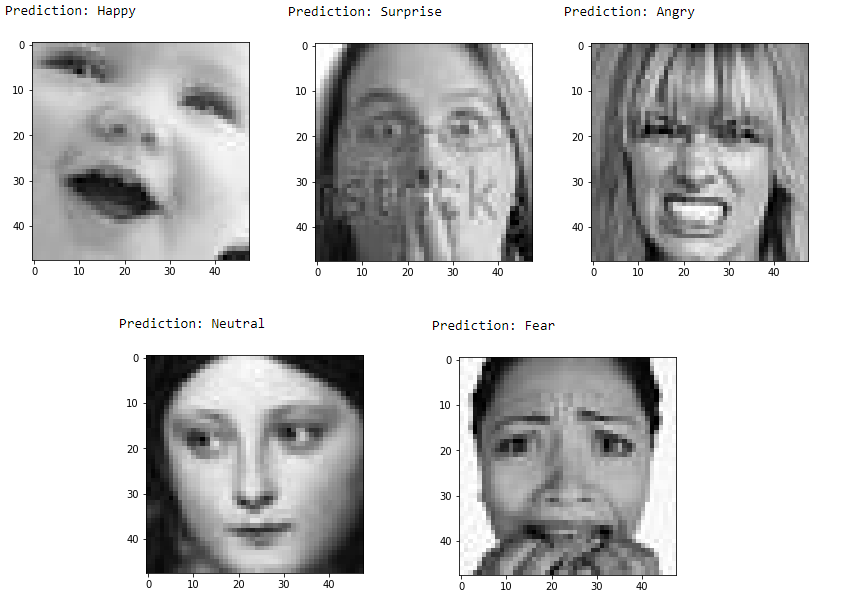

# Recognition Induces Emotional of Audience In Cinema.
The purpose of this project is to recognize the emotions of the audience real-time in the cinema to evaluate their feelings in relation to each movie scene.
* We presents a brand-new problem to the movie business that has never been studied in
public before. Which is Recognition Induces Emotional of Audiences In Cinema.
* This could be a good base, reference for future similar research in this area.
* Real-time deployment with a camera.
## Requirement
* pip install -r requirements.txt


## Architecture
* An end-to-end deep learning framework, based on attentional convolutional network
* Attention mechanism is added through spatial transformer network


<p align="center">
  
</p>


## Datasets
* [FER2013](https://www.kaggle.com/c/challenges-in-representation-learning-facial-expression-recognition-challenge/data)
  + Includes 28709 examples in the train set, 7178 examples in the test set.
  + Data is collected in the form of a CSV file with 3 fields of information:
    1. Emotion: Labeled from 0 to 6 represents Human Emotions 0=Angry,
    1=Disgust, 2=Fear, 3=Happy, 4=Sad, 5=Surprise, 6=Neutral.
    2. Usage: Data used to train or test.
    3. Pixels: Consists of a sequence of pixels that make up an image.
  + Each image will have a resolution of 48x48.
  + Black-White image.
* [CK+](https://www.kaggle.com/datasets/shawon10/ckplus)
  + Includes 981 examples total.
  + The data is divided into several folders, the folder name is the emotion of the image
  according to 7 types of emotions of each person.
  + 7 Types of emotions are: Anger, Contempt, Disgust, Fear, Happy, Sadness, Surprise.
  + Each image will have a resolution of 48x48.
  + Black-White image.
* [WiderFace](http://shuoyang1213.me/WIDERFACE/)
  + Included 32203 images contain 393703 faces with a high degree of variability in
  scale, pose and occlusion.
  + Is organized based on 61 event classes. For each event class, randomly select
  40%/10%/50% data as training, validation and testing sets.
  
## Structure of this repository
This repository is organized as :
* [main](/main.py) This file contains setup of the dataset and training loop.
* [visualize](/visualize.py) This file contains the source code for evaluating the model on test data and real-time testing on webcam.
* [deep_emotion](/deep_emotion.py) This file contains the model class
* [data_loaders](/data_loaders.py) This file contains the dataset class
* [generate_data](/generate_data.py) This file contains the setup of the [dataset](https://www.kaggle.com/c/challenges-in-representation-learning-facial-expression-recognition-challenge/data)
* [Yolov5](/Yolov5) This folder contains the setup of yolov5 models.
* [models](/models) This folder contains the model of yolov5.
* [Webcam](/Webcam) This folder contains real-time images from the webcam.
* [detect_face.py](/detect_face.py) This file contains the face detecting method using yolov5 model.


## Usage
Cool [video](https://www.youtube.com/watch?v=yN7qfBhfGqs) created by [DeepLearning_by_PhDScholar](https://www.youtube.com/channel/UCUv49cJ3xwr1NXxl9qIJ7kA/about) for how to use this implementation.
### Data preparation
Download the dataset from [Kaggle](https://www.kaggle.com/c/challenges-in-representation-learning-facial-expression-recognition-challenge/data), and decompress ```train.csv``` and ```test.csv``` into ```./data``` folder.

### How to run
**Setup the dataset**
```
python main.py [-s [True]] [-d [data_path]]

--setup                 Setup the dataset for the first time
--data                  Data folder that contains data files
```

**To train the model**
```
python main.py  [-t] [--data [data_path]] [--hparams [hyperparams]]
                                [--epochs] [--learning_rate] [--batch_size]

--data                  Data folder that contains training and validation files
--train                 True when training
--hparams               True when changing the hyperparameters
--epochs                Number of epochs
--learning_rate         Learning rate value
--batch_size            Training/validation batch size
```

**To validate the model**
```
python visualize.py [-t] [-c] [--data [data_path]] [--model [model_path]]

--data                  Data folder that contains test images and test CSV file
--model                 Path to pretrained model
--test_cc               Calculate the test accuracy
--cam                   Test the model in real-time with webcam connect via USB
```
## Prediction Samples
<p align="center">
  
</p>
